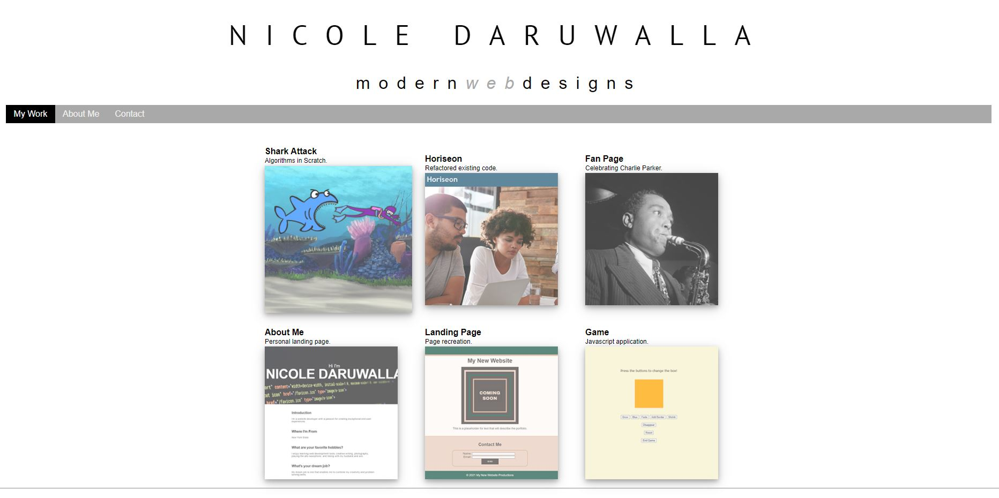
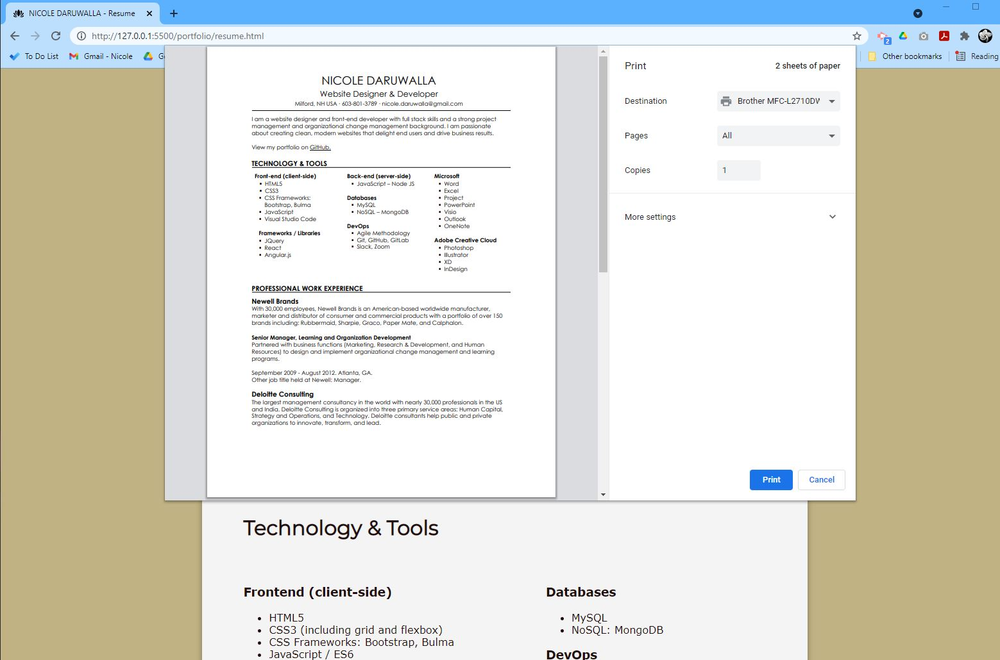

# Portfolio

### Nicole Daruwalla - Website Designer/Developer

## Description

I developed a webpage for potential employers to sample the work I have created. I'll use the currently linked projects as placeholders until I have completed more advanced projects to showcase my skills. 

## Objective
 To obtain an interview with a potential employer.

## Skills Hightlighted
HTML, CSS, flexbox, media queries, and CSS variables.  


## User Story

```
AS a potential employer/hiring manager
I WANT to view a potential employee's deployed portfolio of work samples
SO THAT I can review samples of their work and assess whether they're a good candidate for an open position

```
## Wireframe

A wireframe document was created in PowerPoint. See attached PDF.

## Screen Capture

The following screen capture shows my web portfolio's appearance and functionality:



The following screen capture shows my resume page appearance:



## Key Features of this application
* Potential employers can sample my previous work and view my resume
* Potential employers can view my name, resume, a recent photo, learn about me, view my projects, and contact me via email or LinkedIn
* The UI scrolls to the corresponding section
* When the My Work link is clicked the UI scrolls to the section with titled images of my applications
* Upon hover the application's image is larger in size than the others
* When the application image is clicked the deployed application renders in the browser
* The page is responsive to various screens and devices and the layout adapts to various viewports
* A favicon is displayed in the browser tab


## Deployed application

The URL of the deployed application.
https://ndaruwalla.github.io/portfolio/

## GitHub repository

The URL of the GitHub repository that contains my code.
https://github.com/NDaruwalla/portfolio/


