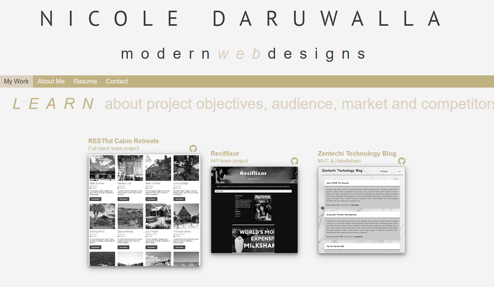

# Portfolio

### Nicole Daruwalla - Website Designer & Front-end Developer

## Description

I developed a webpage for potential employers to sample the work I have created. The projects included demonstrate my front-end and back-end web development skills. 

## Objective
 To obtain an interview with a potential employer.

## Skills Hightlighted
HTML, CSS, flexbox, media queries, JavaScript, Node JS andMySQL. 


## User Story

```
AS a potential employer/hiring manager
I WANT to view a potential employee's deployed portfolio of work samples
SO THAT I can review samples of their work and assess whether they're a good candidate for an open position
```

## Screen Captures

### Portfolio Homepage
This screen capture shows my web portfolio's appearance and navigation



### Resume
This screen capture shows the print function of the resume page.


## Key Features of this application
* Potential employers can sample my previous work and view my resume
* Potential employers can view my name, resume, a recent photo, learn about me, view my projects, and contact me via email or LinkedIn
* The UI scrolls to the corresponding section
* When the My Work link is clicked the UI scrolls to the section with titled images of my applications
* Upon hover the application's image is larger in size than the others
* When the application image is clicked the deployed application renders in the browser
* The page is responsive to various screens and devices and the layout adapts to various viewports
* A favicon is displayed in the browser tab

## Deployed application

The URL of the deployed application.
https://ndaruwalla.github.io/portfolio/

## GitHub repository

The URL of the GitHub repository that contains my code.
https://github.com/NDaruwalla/portfolio/

## Questions
If you have questions or need help with this application:

Contact me on GitHub:
[ndaruwalla](https://github.com/ndaruwalla)
 
Or, via [Email](mailto:nicole.daruwalla@gmail.com)

